# Dineary 요구사항 분석 및 구현 설계서

| 항목 | 내용 |
| --- | --- |
| 문서 버전 | 0.1 · 검토용 초안 |
| 작성일 | 2026-09-22 |
| 기준 문서 | [고객 요구사항](requirements.md), A1~Q3 총 28개 |
| 목적 | 요구사항을 업무 규칙·데이터·구현 책임·검증 기준으로 변환 |
| 범위 | 회원, 음식점, 검색·위치, 리뷰·저장, 예약·운영, 캐시, 향후 쿠폰 |
| 승인 상태 | 기술 제안과 수치 목표는 미승인. 구현 완료를 의미하지 않음 |
| 변경 원칙 | 고객 요구사항 ID는 유지하고, 정책 변경 시 영향받는 설계·테스트를 함께 갱신 |

## 목차

1. [분석 범위와 현재 상태](#1-분석-범위와-현재-상태)
2. [이해관계자와 접근 권한](#2-이해관계자와-접근-권한)
3. [요구사항 추적표](#3-요구사항-추적표)
4. [시스템 구조와 설계 원칙](#4-시스템-구조와-설계-원칙)
5. [도메인 모델과 ERD](#5-도메인-모델과-erd)
6. [데이터 사전과 무결성](#6-데이터-사전과-무결성)
7. [회원가입·인증 상세 분석](#7-회원가입인증-상세-분석)
8. [탐색·리뷰·예약·운영 구현](#8-탐색리뷰예약운영-구현)
9. [Redis 캐시 설계](#9-redis-캐시-설계)
10. [쿠폰·대기열·분산 락 설계](#10-쿠폰대기열분산-락-설계)
11. [API와 오류 계약](#11-api와-오류-계약)
12. [품질·보안·운영 요구](#12-품질보안운영-요구)
13. [인수 기준과 검증 계획](#13-인수-기준과-검증-계획)
14. [구현 순서와 완료 기준](#14-구현-순서와-완료-기준)
15. [미정 정책·위험·의사결정](#15-미정-정책위험의사결정)

## 1. 분석 범위와 현재 상태

### 1.1 현재 확인된 상태

- 저장소 기준 Java 21, Maven, Spring Boot 4.1.1, MyBatis 4.1.0 설정이 있다. 버전 호환성 검증은 실제 구현 시작 시 수행한다.
- Docker Compose에 MySQL 8.4와 Redis 8이 선언되어 있다. 현재 단일 Redis 설정은 운영용 고가용성 구성을 의미하지 않는다.
- 백엔드는 시작 클래스·기본 테스트만 존재한다. 도메인 테이블, 실제 인증, API, 트랜잭션 처리는 아직 없다.
- 프런트엔드는 샘플 음식점과 브라우저 저장 방식의 프로토타입이다. 회원가입 즉시 로그인, 가입 이메일 중복 안내, 가상 지도·예약은 최종 정책과 다르다.
- 프로토타입의 비밀번호·사용자 ID·리뷰 데이터는 운영 인증 자료로 이관하지 않는다. 실제 서버 전환 시 체험 데이터임을 안내하고 새로 가입하게 한다.

### 1.2 범위와 단계

| 단계 | 제공 범위 | 단계 종료 조건 |
| --- | --- | --- |
| M1 핵심 서비스 | A1~A4, B1~B3 기본 검색·위치, R1·R3, S4 기본 운영, Q1~Q3 | 실제 이메일 인증 및 음식점 탐색·리뷰·저장 흐름 완료 |
| M2 서비스 확장 | B2 고급 검색, B4, R2 고도화, S1~S3, P1~P5 | 예약 정합성, 운영 정책, 캐시 장애 검증 완료 |
| M3 쿠폰 확장 | C1~C5 및 관련 S2·S4 | 동시 발급·대기열·장애 복구 검증 완료 |

단계 구분은 개발 제안이다. 이메일 공격 대응·기본 권한 검사·무결성은 후순위 기능으로 미루지 않는다. 결제, 배달 중개, 실제 주문 시스템, 콘서트 티켓 판매는 현재 범위에 없다. 쿠폰 사용 확인은 사장님 확인 방식부터 검토한다.

## 2. 이해관계자와 접근 권한

| 행위 | 비회원 | 인증 회원 | 해당 가게 사장님 | 관리자 |
| --- | --- | --- | --- | --- |
| 공개 음식점·리뷰 탐색 | 가능 | 가능 | 가능 | 가능 |
| 개인 저장·리뷰·예약·쿠폰 | 불가 | 본인 것 | 본인 것 | 타인 비공개 내역은 업무상 승인 범위만 |
| 가게 정보·예약 정원 변경 | 불가 | 오류 제보 | 소유 확인된 가게 | 가능·감사 기록 |
| 리뷰 변경 | 불가 | 본인 작성물 | 답글만, 타인 리뷰 수정 불가 | 숨김·복구, 작성자 본문 임의 변경 불가 |
| 신고·이의제기 | 공개 정보 오류 제보 정책 별도 | 가능 | 가능 | 처리 담당 |
| 쿠폰 발급·사용 | 불가 | 본인 발급·사용 요청 | 해당 가게의 사용 확인 | 캠페인 운영·이력 조회 |

가게 소유 권한은 단순 `OWNER` 역할만으로 판단하지 않고, 회원과 음식점의 승인된 소유 관계를 함께 확인한다. 개인 자원 조회·수정은 세션의 회원 ID로 범위를 제한한다. 요청 본문의 `memberId`를 신뢰하지 않는다.

## 3. 요구사항 추적표

각 행은 구현 작업과 인수 테스트의 연결점이다. AT 식별자는 13장의 검증 시나리오를 가리킨다.

| ID | 핵심 기대 동작 | 구현 책임·주요 데이터 | 상세 절 | 검증 |
| --- | --- | --- | --- | --- |
| A1 | 이메일 계정·공개 닉네임 | Identity / members, registration_intents | 7 | AT-A1 |
| A2 | 이메일 소유 확인·동시 중복 방지 | Identity / 인증 토큰·이메일 유일성 | 7 | AT-A2 |
| A3 | 계정 탐색·메일 폭탄·대입 제한 | Identity / rate limit, mail suppression | 7 | AT-A3 |
| A4 | 세션·복구·탈퇴·개인 기록 | Identity / session, auth_version | 7 | AT-A4 |
| B1 | 음식점 정보·목록·상세 | Restaurant / 메뉴·영업시간·사진 | 8.1 | AT-B1 |
| B2 | 검색·필터·정렬·검색 보조 | Discovery / 검색 문서·검색 이력 | 8.2 | AT-B2 |
| B3 | 주변 가게·지도 | Discovery / 좌표·지역 | 8.2 | AT-B3 |
| B4 | 순위·추천·신규 사용자 대응 | Discovery / 통계·취향·이벤트 | 8.3 | AT-B4 |
| R1 | 리뷰 변경과 집계 반영 | Review / reviews, restaurant_stats | 8.4 | AT-R1 |
| R2 | 작성 정책·신뢰도·조작 대응 | Review + Moderation / reports | 8.4 | AT-R2 |
| R3 | 저장·컬렉션 공개 범위 | Collection / bookmarks, collections | 8.5 | AT-R3 |
| S1 | 예약·정원·상태 관리 | Reservation / slots, reservations | 8.6 | AT-S1 |
| S2 | 이벤트 알림·수신 설정 | Notification / outbox, notifications | 8.7 | AT-S2 |
| S3 | 소유 승인·가게 관리·답글 | Ownership / owner_claims, owners | 8.1·8.7 | AT-S3 |
| S4 | 운영·신고·이력 | Moderation / reports, appeals, audit | 8.7 | AT-S4 |
| P1 | 인기 조회 가속·갱신 | Discovery + Cache / 조회 DTO 캐시 | 9 | AT-P1 |
| P2 | 없는 데이터 공격 방어 | Cache / negative cache·요청 제한 | 9.2 | AT-P2 |
| P3 | 대량 만료·Redis 장애 대응 | Cache / 분산 만료·부하 제한 | 9.2 | AT-P3 |
| P4 | 인기 키 만료 시 중복 갱신 억제 | Cache / single-flight·갱신 락 | 9.2 | AT-P4 |
| P5 | 성능 개선·장애 증거 | Observability / 지표·부하 결과 | 12·13 | AT-P5 |
| C1 | 쿠폰 조건·일정·내역 | Coupon / campaigns, user_coupons | 10 | AT-C1 |
| C2 | 중복·초과 발급·사용 방지 | Coupon / quota·조건부 변경 | 10.2 | AT-C2 |
| C3 | 다중 서버·락 만료에도 정합성 | Coupon / Redis lock + DB 트랜잭션 | 10.3 | AT-C3 |
| C4 | 접수 순서·대기·폭주 대응 | Coupon / requests, queue_state | 10.1 | AT-C4 |
| C5 | 재현 가능한 동시성 검증 | Coupon / 부하·장애 시나리오 | 13 | AT-C5 |
| Q1 | 모바일·키보드·상태 안내 | Frontend / 화면 상태 모델 | 12.1 | AT-Q1 |
| Q2 | 개인정보·공개 범위·삭제 | 전 도메인 / consent·retention | 12.2 | AT-Q2 |
| Q3 | 실패 추적·복구·중복 방지 | 전 도메인 / outbox·audit·backup | 12.3 | AT-Q3 |

## 4. 시스템 구조와 설계 원칙

### 4.1 구조 제안

초기에는 모듈형 모놀리스로 구현한다. 쿠폰 검증 시 동일 애플리케이션을 2개 이상 실행해 다중 서버 경쟁을 재현한다. 마이크로서비스·별도 메시지 브로커는 현재 필수 조건이 아니다.


[그림 크게 보기](diagrams/architecture.svg)

<details>
<summary>Mermaid 원본</summary>

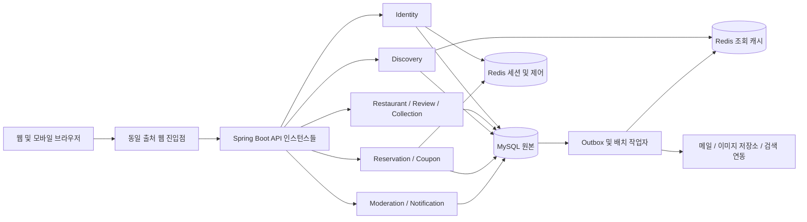

</details>

운영에서는 재생성 가능한 캐시와 세션·요청 제한·락을 Redis 인스턴스 또는 배포 단위로 분리하는 방안을 권장한다. 논리 DB 번호만 나누면 메모리·장애·eviction 정책까지 격리되는 것은 아니다. 개발 Compose 단일 인스턴스는 학습·로컬 검증용이다.

### 4.2 책임과 경계

| 계층 | 책임 | 금지할 결합 |
| --- | --- | --- |
| HTTP Controller | DTO 검증, 인증 주체 전달, 상태 코드 | SQL 직접 실행, 비즈니스 상태 전이 결정 |
| Application Service | 유스케이스, 트랜잭션, 권한·멱등성 조정 | 외부 메일 전송을 DB 락 보유 중 실행 |
| Domain Policy | 예약·쿠폰·리뷰 규칙, 상태 전이 | HTTP·Redis 라이브러리 의존 |
| MyBatis Mapper | 파라미터 바인딩, 조회·조건부 갱신 | 사용자 입력을 SQL 식별자로 직접 삽입 |
| Adapter / Worker | Redis·메일·지도·이미지·작업 재시도 | 외부 호출 성공을 DB 커밋과 동일시 |

Spring Security와 서버 세션을 인증 후보로 추가한다. Redis 클라이언트, 마이그레이션 도구, API 명세 도구, 실제 DB 통합 테스트 도구의 버전은 현재 Boot BOM과 호환되는 조합을 별도 확인한다. 이 문서는 의존성 설치를 수행하지 않는다.

### 4.3 핵심 불변조건

1. 하나의 비교용 이메일에는 활성 계정이 최대 하나다. 닉네임은 자원 소유권 키가 아니다.
2. 예약 점유 인원은 슬롯 정원을 초과하지 않으며 취소 시 중복 차감되지 않는다.
3. 쿠폰 누적 발급 수는 캠페인 발급 수량을 초과하지 않는다. 회원별 발급 한도도 별도로 지킨다.
4. 발급 쿠폰 한 장은 동시에 한 번만 사용 완료될 수 있다.
5. 리뷰의 공개 상태·별점과 집계값 변경은 한 트랜잭션에서 일치한다.
6. Redis·알림·검색 색인은 원본 업무 데이터의 유일한 보관 장소가 아니다.
7. 재시도할 수 있는 모든 쓰기는 업무 키 또는 멱등성 키로 중복 효과를 막는다.

## 5. 도메인 모델과 ERD

아래 ERD는 논리 설계다. 주요 엔터티와 관계를 보여주며, 전체 열과 물리 타입은 6장의 제약사항을 바탕으로 마이그레이션 작성 시 확정한다. `||`는 정확히 하나, `o|`는 0 또는 1, `o{`는 0개 이상을 뜻한다. Redis 키는 관계형 ERD에 포함하지 않는다.

### 5.1 회원·음식점·리뷰·컬렉션


[그림 크게 보기](diagrams/erd-core.svg)

<details>
<summary>Mermaid 원본</summary>

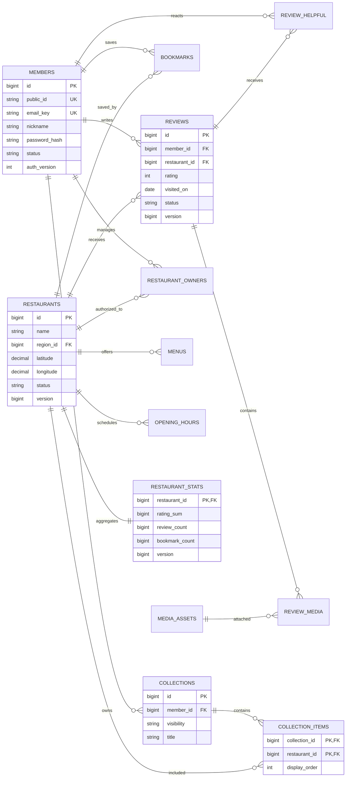

</details>

가입 대기 데이터는 `registration_intents`에 별도로 저장한다. 활성 회원에 연결되기 전이므로 `members`의 필수 자식으로 표현하지 않는다. 지역·카테고리·편의시설·가게 사진·신고 등 보조 관계는 6장 데이터 사전에 정의한다.

### 5.2 예약·알림·운영


[그림 크게 보기](diagrams/erd-service.svg)

<details>
<summary>Mermaid 원본</summary>

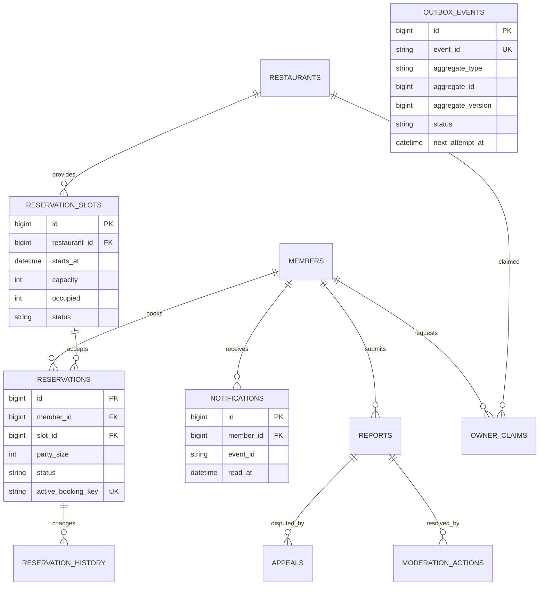

</details>

`outbox_events`는 여러 도메인의 이벤트를 담는다. `aggregate_id`는 일반 FK가 아니며 도메인별 어댑터와 검증으로 참조한다. 알림의 `(member_id, event_id, channel)` 유일성이 중복 전달을 제한한다.

### 5.3 쿠폰·대기열·사용 이력


[그림 크게 보기](diagrams/erd-coupon.svg)

<details>
<summary>Mermaid 원본</summary>

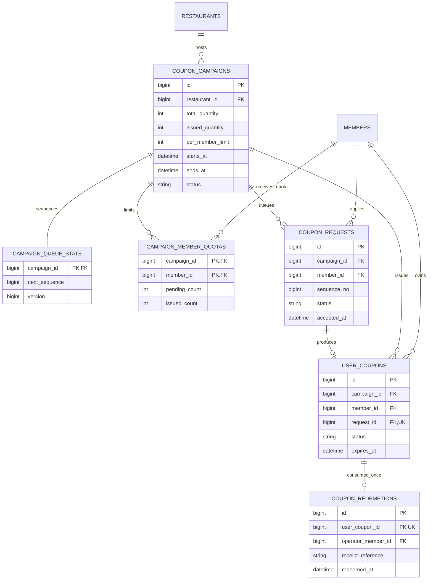

</details>

한 요청은 쿠폰 한 장에 대응한다. `per_member_limit`은 가변이므로 `(campaign_id, member_id)`를 발급 쿠폰의 유일 키로 잡지 않는다. 회원별 누적 발급·대기 수는 별도 quota 행으로 관리한다. 최초 운영은 1장 제한을 제안하되 고객 승인 전 확정하지 않는다.

## 6. 데이터 사전과 무결성

### 6.1 공통 규칙

- MySQL InnoDB를 원본 저장소로 사용하고 금액은 정수 원 단위, 할인율은 정수 basis point 후보로 저장한다. 부동소수점으로 결제 금액을 계산하지 않는다.
- 시간은 UTC `DATETIME(6)`, 방문일은 해당 가게 현지 날짜 `DATE`, 영업시간은 현지 시각과 `Asia/Seoul` 같은 시간대를 함께 해석한다. 자정을 넘는 영업시간도 표현한다.
- 내부 PK는 `BIGINT`, 외부 공개 식별자는 예측하기 어려운 식별자 후보를 사용한다. 식별자가 불투명해도 권한 검사를 생략하지 않는다.
- 비교용 이메일에는 명시적인 비교 규칙과 collation을 적용한다. DB 기본 대소문자·악센트 무시 설정에 계정 동등성 판단을 맡기지 않는다.
- 생성·수정 시각, 필요한 행의 `version`, 개인정보 삭제 기준을 포함한다. 소프트 삭제는 개인정보 파기를 대신하지 않는다.
- 페이지 크기·본문 길이·업로드 크기를 서버에서 제한하고, 검색 정렬 필드는 허용 목록으로 매핑한다.

### 6.2 핵심·보조 테이블 목록

| 테이블 / 묶음 | 주요 데이터·제약 | 관련 요구 |
| --- | --- | --- |
| members | email_original, email_key UNIQUE, password_hash, nickname, status, verified_at, auth_version | A1~A4 |
| registration_intents | email_key, password_hash, nickname, token_hash UNIQUE, context_hash, expires_at, consumed_at; 이메일별 미완료 수 제한 | A1~A3 |
| password_reset_tokens | member_id FK, token_hash UNIQUE, expires_at, consumed_at, auth_version_at_issue | A4 |
| member_roles | UNIQUE(member_id, role); 사장님 가게 권한은 별도 관계 | A4·S3·S4 |
| member_preferences / member_consents | 음식 취향·알림 설정, 동의 종류·버전·시각·철회 | A4·B4·Q2 |
| mail_suppressions | 주소 식별용 HMAC, 반송 유형, 제한 만료; 원문 이메일 최소 보관 | A3 |
| regions / categories / amenities | 지역 계층·음식 종류·편의시설 사전 | B1~B3 |
| restaurants | 지역 FK, 이름·주소·좌표·연락처·상태, merged_into_id 자기 FK, version | B1·S4 |
| restaurant_categories / restaurant_amenities | 가게와 사전 값의 N:M 관계, 각각 복합 UNIQUE | B1·B2 |
| restaurant_sources | UNIQUE(source, external_id), restaurant_id FK, 출처·갱신일·이용 조건 | B1·S4 |
| menus | restaurant_id FK, 이름·가격·판매 상태·정렬 | B1 |
| opening_hours / opening_exceptions | 요일별 복수 시간대·브레이크타임·익일 종료, 특정일 휴무·변경 | B1·B2·S3 |
| media_assets / restaurant_media | 업로더·저장 키·검증 상태·크기, 가게 연결·순서 | B1·R1 |
| restaurant_stats | restaurant_id PK/FK, rating_sum, review_count, 별점 1~5별 개수, bookmark_count, version | R1·B4·P1 |
| reviews / review_media | 작성자·가게 FK, 별점 1~5 CHECK, 방문일·본문·공개 상태·버전; 사진 연결 UNIQUE | R1·R2 |
| review_helpful / owner_replies | UNIQUE(member_id, review_id); 답글 작성자의 가게 권한 확인 | R1·S3 |
| bookmarks | UNIQUE(member_id, restaurant_id); 중복 PUT은 동일 결과 | R3 |
| collections / collection_items | 소유자·공개 범위·공유 식별자, UNIQUE(collection_id, restaurant_id) | R3 |
| owner_claims / restaurant_owners | 신청 증빙·심사 상태·처리자, UNIQUE(member_id, restaurant_id)·활성 상태 | S3 |
| reservation_slots | UNIQUE(restaurant_id, starts_at), capacity, occupied, CHECK(0 <= occupied AND occupied <= capacity) | S1 |
| reservations / reservation_history | 슬롯·회원 FK, 인원 양수, starts_at_snapshot, 상태·취소 사유·처리 이력 | S1 |
| reports / appeals / moderation_actions | 신고 대상·사유·상태, 이의제기·판정·담당자; 참조 FK와 대상 종류 일치 검사 | R2·S4 |
| notifications / notification_preferences | 수신자·이벤트·채널 유일성, 읽음 시각·수신 설정 | S2 |
| activity_events / search_history | 동의 범위의 가명 회원 ID·가게·행위·시각, 검색어 보관 만료 | B2·B4·Q2 |
| restaurant_search_documents | 가게별 검색용 문서·원본 버전; 메뉴 등 여러 테이블을 평탄화한 파생 데이터 | B2 |
| ranking_snapshots / ranking_entries | snapshot_id·지역·종류·가게·점수·순위; 스냅샷 공개 상태 | B4·P1 |
| coupon_campaigns | 수량·회원 한도·기간·할인 조건·상태; CHECK(0 <= issued_quantity AND issued_quantity <= total_quantity) | C1~C3 |
| campaign_queue_state | campaign_id PK/FK, next_sequence, version; 승인된 접수 순서 기준 | C4 |
| campaign_member_quotas | PK(campaign_id, member_id), pending_count >= 0, issued_count >= 0; 캠페인 한도와 함께 검사 | C2 |
| coupon_requests | UNIQUE(campaign_id, sequence_no), 회원·캠페인·접수 시각·대기/성공/실패 상태 | C2~C4 |
| user_coupons / coupon_redemptions | request_id UNIQUE, 발급 조건 스냅샷·상태·만료, user_coupon_id UNIQUE 사용 기록 | C1·C2 |
| idempotency_records | UNIQUE(actor_id, operation, key), request_hash, resource_id, result_code, expires_at | S1·C2 |
| outbox_events / processed_events | 이벤트 ID UNIQUE, 처리 기한·재시도 수·lease, UNIQUE(consumer, event_id) | P1·S2·Q3 |
| audit_logs | 작업자·작업 종류·대상·이유·변경 전후 요약·trace_id; 비밀값 제외 | S4·Q3 |

신고 대상은 review_id, restaurant_id, reported_member_id 같은 실제 nullable FK를 두고 대상 하나만 지정되도록 검사한다. 임의의 `target_type + target_id`만 저장하면 DB FK로 보호할 수 없다는 점을 피한다. 초안의 단순 인원 슬롯 모델은 테이블 좌석 배치·겹치는 체류시간 최적화를 포함하지 않는다.

### 6.3 인덱스 후보와 쓰기 경합

| 조회 | 인덱스 후보 | 주의점 |
| --- | --- | --- |
| 로그인 | members(email_key) UNIQUE | 입력 정규화와 collation 일치 |
| 공개 가게 목록 | restaurants(region_id, status, id) | 카테고리·가격 복합 조건은 실행 계획으로 조정 |
| 리뷰 목록 | reviews(restaurant_id, status, created_at, id) | 커서에 created_at과 id 포함 |
| 내 리뷰·예약 | reviews(member_id, created_at, id), reservations(member_id, starts_at_snapshot, id) | starts_at_snapshot은 정렬용 중복 값으로 변경 동기화 필요 |
| 예약 슬롯 | reservation_slots(restaurant_id, starts_at) UNIQUE | 시간대 탐색·경합 행을 정확히 특정 |
| 쿠폰 대기 | coupon_requests(campaign_id, status, sequence_no) | 한 캠페인 순서 처리, 앞 요청을 건너뛰지 않음 |
| 작업 재시도 | outbox_events(status, next_attempt_at, id) | 배치 크기 제한·짧은 claim 트랜잭션 |

모든 조건 조합에 인덱스를 만들지 않는다. 실제 검색 데이터와 쿼리 계획으로 선택한다. DB 데드락은 제한된 횟수의 전체 트랜잭션 재시도로 처리하되, 커밋 결과를 모르는 네트워크 오류는 멱등성 레코드로 먼저 확인한다.

## 7. 회원가입·인증 상세 분석

### 7.1 UC-AUTH-01 회원가입과 이메일 소유 확인

| 항목 | 정의 |
| --- | --- |
| 관련 요구 | A1, A2, A3, Q2 |
| 행위자 | 비회원, 메일 제공자 |
| 사전 조건 | 가입 정책 동의, 유효한 입력, 요청 한도 이내 |
| 성공 결과 | 이메일 유일성을 만족하는 ACTIVE 회원 1명, 일회성 인증 소비 |
| 실패 결과 | 기존 계정 변경 없음, 인증 전 회원 권한 없음 |

1. 브라우저가 이메일·닉네임·비밀번호·확인 값을 제출한다. 서버가 길이·형식·동의를 검증하고 이메일 비교 키를 만든다.
2. 이메일·IP·전체 발송 예산과 요청 본문 크기를 먼저 제한한다. 비싼 비밀번호 해시가 무제한 실행되지 않도록 한다.
3. 무작위 가입 요청 ID와 브라우저 문맥 비밀값을 발급한다. 비밀번호는 Argon2id 등 검증된 password encoder로 해시하며 파라미터는 장비에서 측정한다.
4. 미가입 주소에 대해 짧게 유지되는 가입 대기 요청과 이메일 발송 outbox를 같은 트랜잭션으로 기록한다. 기존 활성 계정은 수정하지 않는다.
5. 가입 여부와 관계없이 동일한 형태의 `202`와 ‘요청을 접수했습니다. 받은편지함을 확인해 주세요.’를 반환한다. 존재 여부를 알려주는 공개 중복확인 API는 만들지 않는다.
6. 작업자가 메일을 발송한다. 토큰 원문은 해시 검증용으로 저장하지 않고, 전달에 필요한 경우 outbox의 제한된 수명 암호화 데이터로만 취급한다. 발송 후 삭제하며 로그·추적 시스템에서 제거한다.
7. 링크 GET은 안내 화면만 연다. 메일 스캐너가 방문했다고 가입되지 않게 한다. 사용자가 인증 POST를 수행하면 토큰·유효기간·사용 상태와 가입을 시작한 문맥 비밀값을 함께 확인한다.
8. 트랜잭션에서 가입 요청을 잠그고 회원을 생성한다. `members.email_key` UNIQUE가 동시 인증 중복을 최종 차단한다. 성공 시 해당 요청을 소비하고 다른 미완료 요청을 무효화한다.
9. 트랜잭션 커밋 후 로그인 단계로 안내한다. 자동 로그인 여부는 정책 승인 사항이며, 본 설계의 기본 제안은 인증 후 비밀번호로 로그인이다.

브라우저 문맥 확인은 공격자가 피해자 이메일과 공격자 비밀번호로 미리 가입한 뒤 피해자가 인증 링크만 눌러 계정을 활성화하는 문제를 줄이기 위한 제안이다. 다른 기기에서 인증 링크를 열면 자동 활성화하지 않고, 이메일 소유 확인 후 새로운 비밀번호를 설정하는 별도 완료 흐름 또는 가입 재시작을 안내한다. 타인의 재발송 요청이 정상 사용자의 최신 토큰을 계속 폐기하지 않도록, 본인 문맥을 확인한 재발송만 기존 요청을 교체한다.

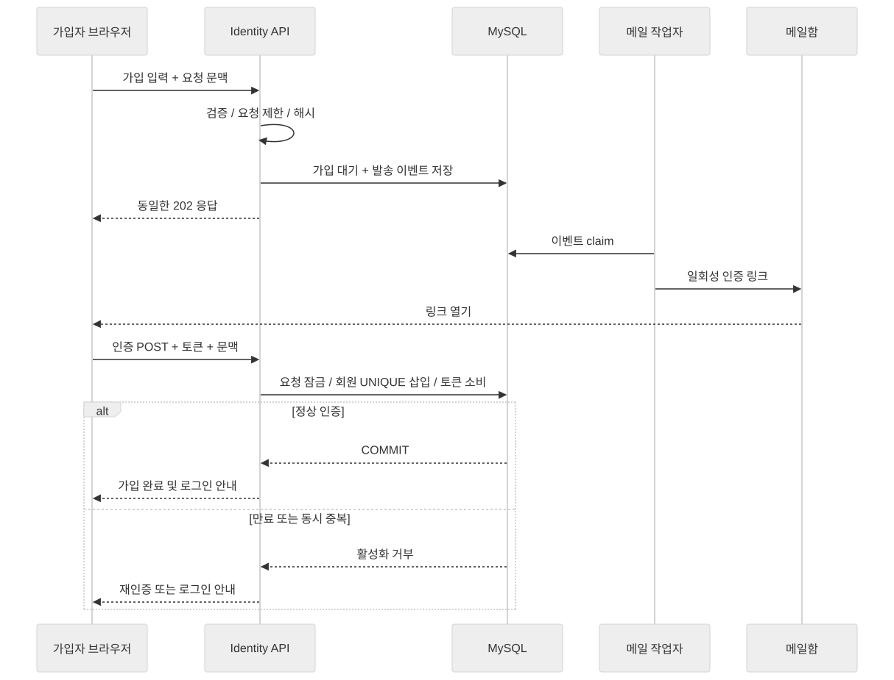

[그림 크게 보기](diagrams/sequence-signup.svg)

<details>
<summary>Mermaid 원본</summary>

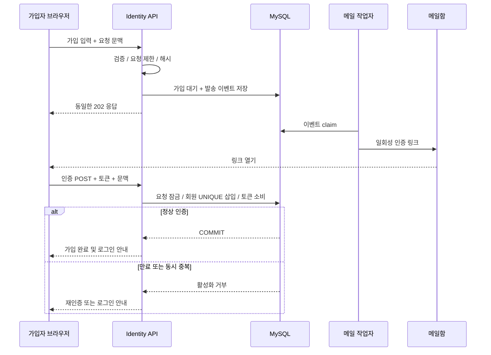

</details>

도메인 부분의 대소문자 처리와 이메일 로컬 부분의 비교 정책은 구분한다. `+태그`·점을 일괄 제거하지 않으며, DNS/MX 확인만으로 메일함의 존재·소유를 증명했다고 판단하지 않는다. 인증 토큰은 충분한 무작위성을 가진 값으로 생성하고 일회성·기간 제한을 적용한다. [OWASP 이메일 검증](https://cheatsheetseries.owasp.org/cheatsheets/Email_Validation_and_Verification_Cheat_Sheet.html)

### 7.2 공격·실패와 대응

| 상황 | 처리 | 확인할 결과 |
| --- | --- | --- |
| 동일 이메일 동시 가입·인증 | DB 유일성 + 일회성 소비 | ACTIVE 1명 이하, 기존 비밀번호 불변 |
| 없는 주소·타인 주소 | 미인증 활동 차단, 요청 만료 | 인증 없이 리뷰·예약·쿠폰 불가 |
| 메일 폭탄 | 주소·출처별 한도, 전체 발송 예산, 재발송 간격 | 한 출처가 서비스 발송량을 소진하지 않음 |
| 영구 반송·일시 지연 | 영구 반송 suppression, 일시 실패 제한 재시도 | 같은 주소에 무한 재발송하지 않음 |
| 사용자 존재 여부 탐색 | 공통 응답·상태 코드·비동기 발송, 타이밍 분포 점검 | 정상·미가입·정지 여부를 쉽게 판별하지 못함 |
| 비밀번호 대입 | 주소·IP별 제한, 위험도에 따른 추가 확인 | 임의 요청으로 피해자 계정 영구 잠금 금지 |
| 토큰 재사용·무차별 입력 | 고엔트로피 토큰, 해시 보관, 시도 제한 | 성공 후 같은 토큰 실패 |
| Redis 제한 기능 장애 | 인증·메일 쓰기를 보수적으로 제한 | 무제한 발송·로그인 시도 허용 금지 |

‘동일 응답’은 완전한 시간 동일성을 보장한다는 뜻이 아니다. 계정 존재에 따른 DB·해시 경로 차이를 줄이고 통계적 검증을 수행한다. 로그인 실패 원인을 공개 응답에서 구별하지 않는 방안은 [OWASP 인증 지침](https://cheatsheetseries.owasp.org/cheatsheets/Authentication_Cheat_Sheet.html)을 따른다. 비밀번호 저장 방식은 [OWASP 비밀번호 저장 지침](https://cheatsheetseries.owasp.org/cheatsheets/Password_Storage_Cheat_Sheet.html)을 기준으로 검토한다.

### 7.3 세션·재설정·탈퇴

- **세션:** 동일 출처 배포와 서버 세션을 기본 제안으로 한다. 쿠키는 운영 HTTPS에서 `Secure`, `HttpOnly`, 적절한 `SameSite`를 사용하고 로그인 시 세션 ID를 교체한다. 인증 토큰을 localStorage에 보관하지 않는다.
- **CSRF:** 쿠키 인증의 쓰기 요청은 CSRF 보호를 적용한다. 가입·로그인·로그아웃을 포함한 브라우저 흐름도 보호 정책을 검토하고, 프런트엔드는 로그인·로그아웃 후 CSRF 토큰을 갱신한다. [Spring Security 세션 관리](https://docs.spring.io/spring-security/reference/servlet/authentication/session-management.html), [CSRF](https://docs.spring.io/spring-security/reference/servlet/exploits/csrf.html)
- **로그아웃:** 서버 세션 제거와 쿠키 만료를 함께 수행한다. Redis 세션 저장소 장애 시 인증된 것으로 추정해 쓰기를 허용하지 않는다.
- **비밀번호 재설정:** 공통 접수 응답 → 일회성 이메일 인증 → 새 비밀번호 해시 저장·토큰 소비·`auth_version` 증가를 한 트랜잭션에서 수행한다. 예전 세션의 버전은 이후 인증 검사에서 거부한다. [OWASP 비밀번호 재설정](https://cheatsheetseries.owasp.org/cheatsheets/Forgot_Password_Cheat_Sheet.html)
- **권한 취소:** 정지·탈퇴·역할 변경 시 세션 무효화 이벤트를 보낸다. 개인 정보 조회와 모든 회원 쓰기는 DB의 회원 상태·auth_version을 다시 검사하므로 이벤트 지연만으로 이전 권한이 지속되지 않는다. 이 조회를 캐시로 바꾸려면 권한 회수의 허용 지연과 장애 정책을 별도로 승인받는다.
- **탈퇴:** WITHDRAWN 전환·세션 폐기 후 개인정보를 승인된 일정에 따라 파기한다. 공개 리뷰의 삭제·익명화, 예약·쿠폰 처리, 재가입 제한은 D-03 정책 확정이 선행되어야 한다.

## 8. 탐색·리뷰·예약·운영 구현

### 8.1 음식점 원본과 소유권 — B1, S3, S4

- 관리자 등록 또는 허가된 데이터 공급 경로를 사용한다. 출처별 외부 ID로 재수집 중복을 막고, 이름이 같다는 이유만으로 병합하지 않는다.
- 주소·좌표·전화·메뉴·카테고리·편의시설을 관리하며 변경 시 가게 version을 증가시킨다. 폐업은 CLOSED, 숨김은 HIDDEN, 병합은 MERGED와 대표 가게 ID로 표현한다.
- 영업 상태는 요일 시간대·예외일·브레이크타임·가게 시간대로 계산한다. 자정 및 휴무 전환이 캐시 시간에 가려지지 않도록 다음 상태 변경 시점을 만료 상한으로 사용한다.
- 사장님 신청은 PENDING → APPROVED 또는 REJECTED. 증빙은 공개 이미지와 분리하고 심사 권한으로만 열람한다.
- 메뉴·가게 변경·답글 API는 승인된 `(member_id, restaurant_id)` 관계를 확인한다. 소유권 취소 즉시 이후 쓰기를 거부한다.

### 8.2 검색·위치 — B2, B3

| 기능 | 초기 구현 | 확장 및 검증 |
| --- | --- | --- |
| 이름·메뉴·지역 검색 | `restaurant_search_documents`에 검색 텍스트를 투영, 정확 일치·접두 검색 우선 | MySQL ngram FULLTEXT 후보, 한국어 평가 문장으로 비교 |
| 자동완성 | 정규화한 가게·메뉴 사전의 접두어 조회 | 인기·지역 가중, 요청 디바운스·최소 길이 |
| 오타·동의어 | 관리형 동의어 사전과 제한된 수정 후보 | 후보 실패 시 원문 결과 유지; 검색 엔진 도입은 품질·부하 측정 후 |
| 필터·정렬 | 지역·종류·가격·편의시설 조합, 허용된 정렬만 SQL 매핑 | 인덱스·실행 계획 검증, 빈 결과 안내 |
| 페이지 이동 | 생성시각·ID처럼 안정적인 정렬의 keyset cursor | 동적 순위는 snapshot_id + rank + id 커서 사용 |
| 주변 조회 | 좌표 경계 상자로 후보 축소 후 실제 거리 계산 | 공간 인덱스 도입 검증, 지도 bounding box·결과 수 상한 |
| 위치 권한 거부 | 지역 중심점 선택 | 주소 검색 실패·GPS 오차·정확도 안내 |

MySQL의 ngram 파서는 CJK 검색 후보로 사용할 수 있지만 한국어 오타 교정과 의미 검색을 자동으로 해결하지 않는다. 검색 문서는 원본보다 늦게 갱신될 수 있으므로, 삭제·비공개 여부는 응답 직전 원본 상태로 확인한다. [MySQL 8.4 FULLTEXT](https://dev.mysql.com/doc/refman/8.4/en/fulltext-search.html)

지도 API·좌표계는 공급자 확정 후 정한다. 경도/위도 순서를 API 경계에서 명시하고, 좌표 유효 범위·반경 최대값·지도 이동 빈도를 제한한다. 개인의 정확한 위치는 기본적으로 요청 처리에만 사용하고, 저장은 별도 동의를 받은 경우로 제한한다.

### 8.3 랭킹·추천 — B4, P1

- 초기 랭킹은 평점·유효 리뷰 수·최근성을 사용한 명시적 점수로 시작한다. 단순 별점 평균만으로 리뷰 1개인 가게가 전체 상위에 고정되지 않도록 최소 근거량 또는 보정 평균을 제안한다.
- 점수식·광고 노출·조작 제외 정책은 D-05 승인 사항이다. 예시 수식을 서비스 확정 정책으로 취급하지 않는다.
- 배치가 새로운 ranking snapshot을 완성한 뒤 active snapshot 참조를 전환한다. 사용자 요청은 완성된 동일 스냅샷의 순서를 본다.
- 추천은 지역·선호 음식·저장 이력 기반 규칙부터 시작한다. 이력이 없거나 동의하지 않은 회원은 지역별 기본 인기 목록을 받는다.
- 품질 검증은 검색어 테스트셋의 상위 결과 적합성, 빈 결과율, 추천 저장률 등으로 평가한다. 클릭 수만으로 품질을 판단하지 않는다.

### 8.4 리뷰와 집계 — R1, R2

별점 1~5 정수, 방문일은 가게 현지 오늘 이전 또는 당일, 본문·사진 개수·재방문 작성 간격은 승인된 정책으로 검사한다. 실제 방문 증빙이 없다면 ‘방문 인증’이라고 표시하지 않는다.

1. 작성·변경·숨김 요청에서 소유권 또는 운영 권한을 확인한다.
2. 같은 가게의 통계 행 → 리뷰 행 순서로 잠그고, 이전 상태·별점과 새 상태·별점의 차이를 계산한다.
3. 공개 리뷰에 대해서만 rating_sum·review_count·별점별 개수를 증감한다. `review_count=0`이면 평균은 별점 없음으로 표시한다.
4. 리뷰·집계·캐시 무효화 outbox를 한 트랜잭션으로 커밋한다. 수정은 version 조건으로 충돌을 감지한다.
5. 재시도는 같은 멱등성 키에 동일 결과를 반환한다. 주기적으로 리뷰 원본에서 집계를 재계산하여 이상을 탐지한다.

공개 상태는 PUBLISHED → HIDDEN / DELETED, 운영 복구는 HIDDEN → PUBLISHED로 제안한다. 신고 접수만으로 무조건 삭제하지 않고 정책에 따라 보류·검토한다. 도움돼요는 복합 UNIQUE와 멱등 PUT/DELETE로 반복 클릭을 처리한다.

이미지는 업로드 크기·실제 파일 형식·해상도를 검사하고, 검증 완료 전 공개하지 않는다. 객체 업로드 성공 후 DB 연결 실패 시 정리 작업으로 고아 파일을 제거하며, DB 커밋 전 파일을 삭제하지 않는다. EXIF 위치정보 제거를 기본 제안으로 한다.

### 8.5 저장·컬렉션 — R3

저장은 회원·가게 복합 유일성을 갖는다. 컬렉션은 PRIVATE / UNLISTED / PUBLIC 후보로 구분하고 조회·공유·수정에서 각각 권한을 확인한다. 비공개 응답을 공용 CDN·Redis 결과에 섞지 않는다. 공개 범위 축소 시 기존 공유 URL도 새 정책에 따라 차단한다.

### 8.6 예약 정합성 — S1

정원은 ‘한 시간 슬롯에 수용할 인원’으로 정의하는 초기 제안이다. 테이블 배정·예약 시간 겹침이 필요한 서비스라면 별도 자원 모델이 필요하므로 구현 전 D-06에서 결정한다.

```text
REQUESTED → CONFIRMED → COMPLETED 또는 NO_SHOW
REQUESTED → REJECTED 또는 CANCELLED 또는 EXPIRED
CONFIRMED → CANCELLED
```

- REQUESTED도 정원을 점유한다. 승인 대기 만료 시간을 두고 작업자가 EXPIRED로 전환하며 점유를 반환한다. 자동 확정이면 같은 트랜잭션에서 CONFIRMED까지 진행한다.
- 슬롯 행 → 예약 행 순서로 잠근다. `occupied + party_size <= capacity`를 만족할 때만 점유를 늘리고 예약을 생성한다.
- 같은 회원이 같은 슬롯에 복수의 활성 예약을 만들 수 없도록 nullable `active_booking_key`를 유일 키로 사용한다. 활성 상태에서만 회원·슬롯 조합 값을 유지하며, 취소·거절·만료 시 NULL로 해제한다.
- 취소·만료는 현재 상태 조건을 통과한 첫 변경만 점유를 반환한다. 취소와 관리자 확정이 경합해도 상태와 인원이 함께 커밋된다.
- 사장님이 정원을 낮출 때 현재 occupied보다 작게 변경할 수 없다. 예약 시각·가게·인원 변경은 기존 예약 취소 후 새 예약 또는 별도 원자적 변경 흐름으로 정의한다.
- 예약·알림 outbox를 함께 기록한다. 캐시의 ‘예약 가능’ 표시는 참고용이며 확정은 DB에서 판단한다.

### 8.7 알림·관리자·이벤트 전달 — S2~S4, Q3

- 업무 변경 트랜잭션에 outbox를 함께 삽입한다. 작업자는 작은 배치로 claim 후 DB 락을 해제하고 외부 호출을 수행한다.
- claim에는 만료 lease·시도 횟수·다음 재시도 시각을 두며, 죽은 작업자의 이벤트는 다시 처리한다. 영구 실패는 운영자가 원인과 재처리 결과를 볼 수 있게 한다.
- 전달은 at-least-once를 전제로 한다. 내부 알림은 수신자·이벤트·채널 유일성으로 중복을 막고, 메일 제공자가 멱등 키를 지원하면 event_id를 전달한다. 지원하지 않으면 드문 중복 메일 가능성을 인정하며 일회성 업무 효과와 구분한다.
- 같은 가게의 오래된 이벤트가 최신 상태를 덮지 않도록 aggregate_version을 비교한다. 비동기 작업은 새 권한 확인이 필요한 사장님 요청을 대신 승인하지 않는다.
- 관리자 변경은 행위자·사유·대상·결과를 기록한다. 전체 회원 이메일·신고 증빙 열람은 필요한 역할로 제한한다.

독립적인 outbox 작업을 가져올 때 `SKIP LOCKED`를 검토할 수 있다. 순서가 업무 규칙인 쿠폰 대기열에서는 앞 요청을 건너뛰는 용도로 사용하지 않는다. [MySQL 8.4 locking reads](https://dev.mysql.com/doc/refman/8.4/en/innodb-locking-reads.html)

## 9. Redis 캐시 설계

### 9.1 대상·키·수명 제안

아래 시간은 부하 시험 시작값이며 고객 승인된 SLA가 아니다. 키에 이메일·정확한 위치 등 개인정보 원문을 넣지 않는다.

| 대상 | 키 예시 | 시작 설정 제안 | 변경·복구 |
| --- | --- | --- | --- |
| 공개 가게 상세 DTO | `cache:restaurant:v1:{id}` | fresh 60초, hard 300초, ±20% 무작위 분산 | 커밋 후 outbox 무효화·version 비교 |
| 별점·리뷰 요약 | 상세 DTO 또는 `cache:stats:v1:{id}` | fresh 30초, hard 120초 | 공개 상태 변경과 집계 이벤트 |
| 인기 목록 | `cache:ranking:v1:{region}:{category}:{snapshot}` | 다음 스냅샷 전환까지, 이전본 정리 TTL | 원본 스냅샷에서 재생성 |
| 없음 결과 | `cache:missing:restaurant:{id}` | 15~30초 | 신규 등록·복구 시 무효화 |
| 갱신 락 | `lock:cache:restaurant:{id}` | 최대 DB 조회 시간보다 여유 있는 lease | 소유 토큰 일치 시 해제 |
| 요청 제한 | `limit:{operation}:{identityHmac}:{window}` | 정책별 window | Redis 장애 시 인증·발급 제한 |

캐시는 원본 조회 성공 후에만 채운다. DB 타임아웃·권한 오류를 ‘존재하지 않음’으로 저장하지 않는다. 사용자별 저장 여부·비공개 정보는 공용 음식점 캐시에 포함하지 않는다.

### 9.2 관통·눈사태·붕괴 대응

| 위험 | 처리 설계 | 남는 한계·검증 |
| --- | --- | --- |
| 관통: 같은 없는 ID 반복 | ID 형식 검증, 짧은 negative cache, 계정·IP 요청 제한 | 신규 등록 시 negative cache 제거 |
| 관통: 무작위 없는 ID 대량 | 전체 DB 조회 예산·입력 제한, 필요 시 Bloom filter 후보 | negative cache 메모리 상한; Bloom은 false positive가 있어 존재 증명 수단이 아님 |
| 눈사태: 만료 집중 | TTL jitter, 인기 키 사전 갱신, 복구 warming 속도 제한 | hard 만료 최대값이 고객 허용 지연을 넘지 않도록 제한 |
| 눈사태: Redis 장애 | circuit breaker, 제한된 원본 조회 동시성, 짧은 로컬 공개 캐시·503 | 세션·쿠폰은 캐시 읽기와 같은 완화 정책을 쓰지 않음 |
| 붕괴: 인기 키 하나 만료 | 인스턴스 내부 single-flight + Redis 키별 갱신 락, stale-while-revalidate | 제한 시간 후 재조회·stale·503 중 선택; 무제한 대기·폴링 금지 |
| 갱신 작업 중 서버 중단 | 갱신 락 lease 만료, 기다리던 요청의 제한 재시도 | 락 소유자만 해제; 느린 작업의 늦은 캐시 쓰기 방어 |

Redis 캐시 갱신의 요청 합치기와 임시 락은 원본 조회 부하를 줄이는 수단이다. [Redis cache-aside](https://redis.io/docs/latest/develop/use-cases/cache-aside/), [캐시 갱신 보호 예시](https://redis.io/docs/latest/develop/use-cases/cache-aside/java-jedis/)

### 9.3 읽기 흐름과 갱신 경쟁


[그림 크게 보기](diagrams/cache-flow.svg)

<details>
<summary>Mermaid 원본</summary>

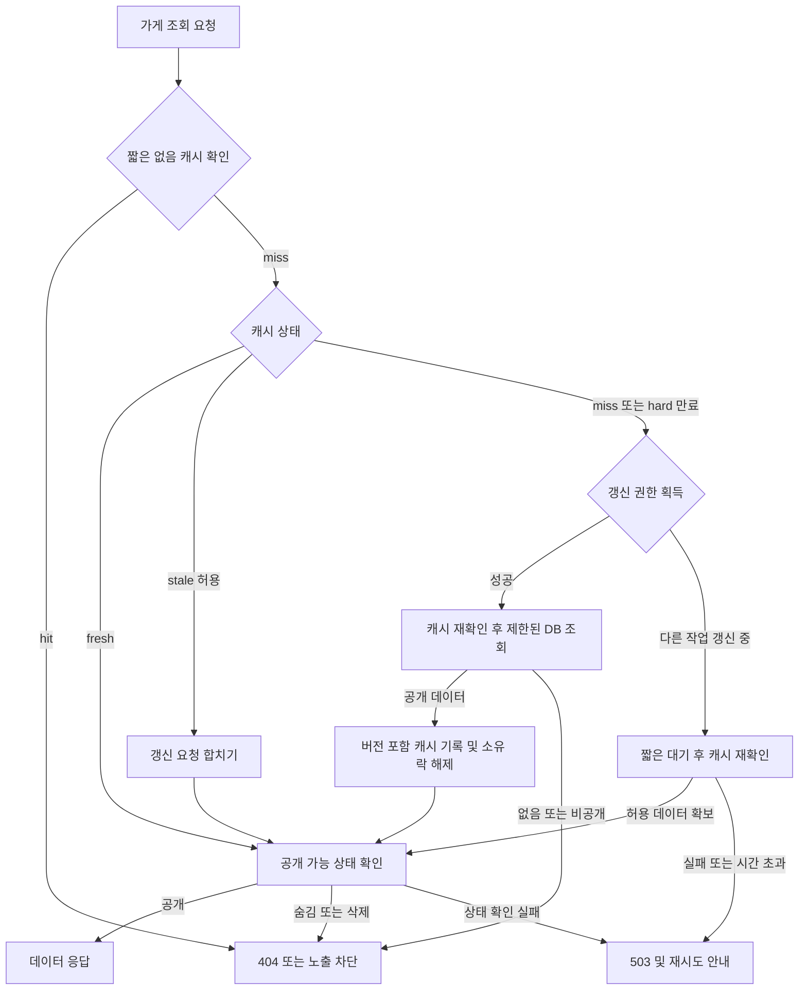

</details>

- 갱신 이벤트에는 version을 포함한다. 캐시 데이터·갱신 세대는 원자적 비교로 이전 버전이 최신 캐시를 덮지 못하게 한다. 삭제 후 느린 이전 조회가 캐시를 재생성하는 경쟁도 테스트한다.
- DB 커밋과 Redis 쓰기는 하나의 원자적 트랜잭션이 아니다. outbox 재시도·주기적 복구·hard TTL로 불일치 시간을 제한한다. 이 방식만으로 즉각적인 삭제를 보장했다고 주장하지 않는다.
- 숨김·삭제를 확정한 뒤 시작되는 읽기에서 노출을 차단하려면, 공개 가능 상태를 DB primary의 작은 인덱스 조회로 확인한다. 목록은 ID를 모아 일괄 확인한다. 확인 장애 시 해당 콘텐츠를 반환하지 않는다. 집계·메뉴 등 큰 조회는 여전히 캐시로 절약한다.
- 위 공개 상태 확인은 반환할 데이터가 있는 경우에 적용한다. 유효한 negative cache hit에는 DB를 다시 조회하지 않아 관통 방어를 유지한다. 원본 조회의 없음·비공개·오류 경로도 finally에서 소유 락을 해제하며, 장애를 404로 숨기지 않는다.
- CDN·로컬 캐시도 위 노출 정책을 우회하면 안 된다. 이미 전송된 화면을 원격으로 회수할 수는 없으며, 삭제 완료 후의 신규 요청부터 보장 범위를 정의한다.
- 원본에서 읽은 시각·버전과 hard 만료를 사용하고 로컬 복사로 만료를 연장하지 않는다. 캐시 metadata가 사라진 경우에도 지연된 loader는 작업 deadline을 넘으면 결과를 게시하지 않는다.
- Bloom filter는 최초부터 필수가 아니다. 도입 시 신규 데이터 등록과 필터 갱신 순서를 정하고 재구축 동안 false negative로 정상 가게를 숨기지 않도록 우회 경로를 검증한다.

## 10. 쿠폰·대기열·분산 락 설계

### 10.1 UC-COUPON-01 신청 접수와 순서

‘선착순’의 제안 정의는 **인증·정책 검사를 통과하고 DB 접수 트랜잭션이 커밋한 캠페인별 sequence 순서**다. 기기의 클릭 시각, HTTP 도착 시각, Redis 락 획득 시각과 다르다. 고객 승인 전에는 선착순 확정 정책으로 홍보하지 않는다.

1. 인증·회원 상태·요청 제한을 검사한다. 이벤트 시작·종료는 클라이언트가 아닌 서버·DB 기준 시각으로 판단한다.
2. `Idempotency-Key`와 요청 hash를 확인한다. 같은 키·내용은 같은 request_id를 반환하고, 같은 키에 다른 내용은 `409`로 거부한다.
3. 접수 트랜잭션에서 `campaign_queue_state → coupon_campaigns → campaign_member_quotas` 순으로 잠근다. 전체 접수 상한·캠페인 상태·회원의 `pending_count + issued_count < per_member_limit`를 검사한다.
4. next_sequence를 증가시키고 요청을 QUEUED로 저장하며 pending_count를 늘린다. 멱등성 결과와 outbox를 함께 커밋한 뒤 `202 + requestId + statusUrl`을 반환한다.
5. Redis 대기 목록은 DB 접수 상태의 파생 뷰로 사용한다. 갱신 유실 시 DB에서 재구축한다. 새로고침은 동일 request_id를 조회하며 새 순서를 부여하지 않는다.
6. 작업자는 캠페인별 가장 작은 미처리 sequence부터 처리한다. 대기 예상 시간은 추정치이며 성공 보장이 아니다.

같은 멱등성 키의 요청 둘이 사전 조회를 동시에 통과해도 UNIQUE 충돌 시 뒤 트랜잭션 전체를 롤백하고 기존 접수 결과를 읽는다. sequence 증가와 quota 예약도 함께 롤백되어야 한다. 키가 다른 중복 클릭은 회원 quota로 제한하며, 한도가 여러 장이면 별도 요청으로 한도 내 추가 발급하는 것이 정상 동작이다.

접수 자체도 DB 직렬화 비용이 있다. 본 설계는 100장·1,000명 검증을 위한 명확한 정합성 기준이며, 수십만 요청 처리량을 보장하지 않는다. 큰 규모에서는 별도 admission 서비스·내구성 있는 ordered log를 검토하되, 순서 보장과 데이터 손실 정책을 다시 승인받는다.

### 10.2 쿠폰 발급 트랜잭션

```text
Redis campaign lock 획득 또는 작업 재예약
  BEGIN
    campaign_queue_state 행 FOR UPDATE
    coupon_campaigns 행 FOR UPDATE
    가장 앞의 QUEUED 요청 확인
    해당 회원 quota 행 FOR UPDATE
    해당 request 행 FOR UPDATE 및 상태 재확인
    정지 회원·기한·재고·발급 한도 검사
    조건 충족 시:
      campaign.issued_quantity += 1
      quota.pending_count -= 1, quota.issued_count += 1
      user_coupons INSERT (request_id UNIQUE)
      request.status = ISSUED
      발급 알림 outbox INSERT
    업무상 거절 시:
      quota.pending_count -= 1
      request.status = SOLD_OUT / EXPIRED / REJECTED
    내부 오류 시: 전체 ROLLBACK, 원래 QUEUED 유지
  COMMIT
Redis lock 해제 (소유 토큰 일치 조건)
```

행 잠금과 조건부 갱신을 함께 사용한다. 아래는 핵심 보호 조건 예시이며, 실제 Mapper는 request·quota·발급·outbox까지 동일 트랜잭션으로 묶는다.

```sql
UPDATE coupon_campaigns
SET issued_quantity = issued_quantity + 1
WHERE id = #{campaignId}
  AND status = 'ACTIVE'
  AND starts_at <= UTC_TIMESTAMP(6)
  AND ends_at > UTC_TIMESTAMP(6)
  AND issued_quantity < total_quantity;
-- affected rows = 1일 때만 다음 쓰기 진행. 0이면 상태를 확인해 업무 결과로 처리.
```

접수는 종료 전에 했지만 실제 발급 처리가 종료 후에 이루어지는 경우를 본 초안은 EXPIRED로 처리한다. ‘접수 시각만 유효하면 종료 후에도 발급’ 정책을 선택하면 캠페인별 처리 유예기간과 상태 전이를 수정해야 한다. 이는 D-08 승인 사항이다.

요청·캠페인·quota·발급 쿠폰의 member_id/campaign_id 일치는 서비스에서 검증하고, 물리 설계에서는 복합 FK 도입도 검토한다. 일시 오류와 업무 거절을 구분하여 내부 오류를 임의의 ‘품절’로 기록하지 않는다.

### 10.3 Redis 분산 락과 DB의 역할

| 수단 | 책임 | 보장하지 않는 것 |
| --- | --- | --- |
| Redis 캠페인별 락 | 서로 다른 API/worker 인스턴스의 동시 작업을 줄임 | 절대적인 선착순, 모든 장애에서 단독 정합성 |
| DB queue_state 잠금 | 같은 캠페인 발급 작업과 sequence를 직렬화 | 무제한 처리량 |
| 조건부 수량 갱신·quota | 재고·회원 한도의 최종 보호 | Redis 대기 화면 최신성 |
| request_id UNIQUE | 같은 요청의 중복 쿠폰 발급 차단 | 다른 계정이 같은 사람인지 식별 |
| 멱등성 기록 | 네트워크 재시도 결과 복원 | 전체 시스템의 exactly-once 전달 |

- 락은 `lock:coupon:{campaignId}`처럼 캠페인 단위로 설정한다. 전체 서비스에 하나의 락을 사용하지 않는다.
- 원자적인 `SET ... NX PX ...`와 무작위 소유 토큰, 소유 토큰 일치 시에만 해제하는 연산을 사용하거나 검증된 클라이언트에 위임한다. 무조건 `DEL`하지 않는다.
- DB 트랜잭션이 끝난 뒤 락을 해제하도록 경계를 둔다. Spring 프록시의 트랜잭션 완료보다 `finally` 해제가 먼저 실행되지 않게, 락 바깥 서비스 → 별도 transactional 서비스 또는 TransactionTemplate 구조를 사용한다.
- 갱신 중 lease가 만료되면 다른 worker가 락을 얻을 수 있다. 두 작업이 실제로 겹쳐도 DB queue_state 잠금과 원본 재검사로 같은 재고를 두 번 발급하지 못하게 한다.
- Redis failover·네트워크 단절 시 락 유실 가능성을 고려한다. 락 확인이 안 되면 새 발급을 중단하고 복구 후 DB QUEUED 요청을 재개한다. 이미 실행 중인 트랜잭션은 DB 규칙으로 결과를 확정한다.
- 외부 시스템 변경처럼 DB로 보호할 수 없는 효과를 추가한다면, 대상이 검증하는 단조 증가 fencing token 또는 외부 멱등성 계약을 별도로 설계한다. 토큰 숫자만 발급한다고 fencing이 성립하지 않는다.

Redis 락의 유효시간·failover·fencing 주의사항을 검토한 설계이며, Redis만으로 강한 일관성을 보장한다는 의미가 아니다. [Redis 분산 락](https://redis.io/docs/latest/develop/clients/patterns/distributed-locks/)

### 10.4 상태와 실패 복구

| 대상 | 상태·전이 제안 |
| --- | --- |
| 캠페인 | DRAFT → SCHEDULED → ACTIVE → ENDED; 운영 PAUSED는 접수·발급을 정지하고 대기 순서를 보존 |
| 신청 | QUEUED → ISSUED / SOLD_OUT / EXPIRED / REJECTED; 트랜잭션 중 처리 표시는 외부 영구 상태로 만들지 않음 |
| 발급 쿠폰 | AVAILABLE → REDEEMED 또는 EXPIRED; 사용 취소는 별도 승인 정책 전까지 미제공 |

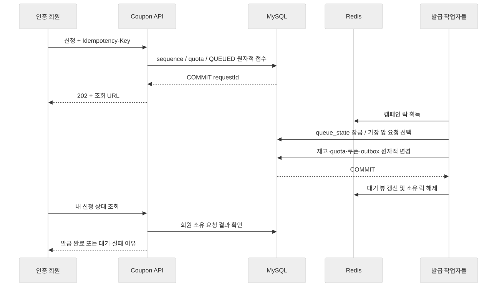

[그림 크게 보기](diagrams/sequence-coupon.svg)

<details>
<summary>Mermaid 원본</summary>

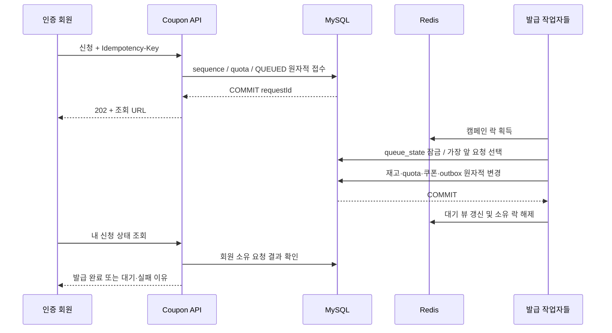

</details>

| 실패 지점 | 복구 방법 |
| --- | --- |
| 접수 COMMIT 후 응답 유실 | 같은 멱등성 키 재요청 시 기존 requestId 반환 |
| 발급 COMMIT 전 worker 중단 | DB 롤백 후 QUEUED 유지, 락 만료 뒤 재시도 |
| 발급 COMMIT 후 Redis 갱신 실패 | DB 결과가 우선, 재시도 시 ISSUED 조회; 대기 뷰 재구축 |
| Redis 데이터 전체 유실 | 발급 잠시 정지 → DB QUEUED·sequence로 재구축 → 순서 검증 후 재개 |
| DB 연결 결과 불명 | 성공·실패 추정 금지; requestId·유일성 키로 원본 조회 |
| 오래된 락 보유자가 복귀 | DB 현재 상태 다시 검사, 이미 처리한 요청에 업무 효과 추가 금지 |
| 첫 요청이 계속 내부 오류 | 뒤 요청 추월 금지; 캠페인 일시 정지·운영자 조사, 정책상 거절 가능할 때만 사유 기록 후 다음 처리 |

### 10.5 쿠폰 사용과 정산 범위

사용 확인은 인증된 사장님이 해당 음식점의 쿠폰을 확인하는 방식부터 제안한다. 회원이 직접 ‘사용 완료’를 누르는 것만으로 할인 적용을 확정하지 않는다.

- 가게 소유 관계·쿠폰 소유 확인 방식·유효기간·최소 주문 금액·할인 한도를 확인한다.
- `AVAILABLE` 조건부 UPDATE와 `coupon_redemptions.user_coupon_id` UNIQUE를 한 트랜잭션으로 처리한다.
- 같은 사용 요청의 재시도는 동일 사용 결과를 반환한다. 다른 영수증에 다시 사용하면 충돌로 거부한다.
- 쿠폰 발급 시 할인 조건을 스냅샷으로 남겨 이벤트 수정이 기존 쿠폰 조건을 소급 변경하지 않게 한다.
- 진행 중 캠페인의 할인 조건·회원 한도 변경은 기본적으로 금지하고 새 캠페인을 사용한다. 수량 증가를 허용하더라도 발급 트랜잭션과 같은 캠페인 행 잠금 아래에서 검증하며, 누적 발급보다 적게 수량을 줄이지 못하게 한다.
- 사용 취소·환불·재고 환원·정산·POS 연결은 D-09 확정 전 구현 완료로 간주하지 않는다. 발급 재고는 누적 발급 기준이며 만료된 쿠폰을 자동으로 재발급 수량에 더하지 않는 것을 기본 제안으로 한다.

## 11. API와 오류 계약

### 11.1 공통 계약

- 기본 경로는 `/api/v1`. 날짜·시간은 ISO 8601과 시간대 표기를 사용한다. 금액 단위와 거리 단위는 각각 원·미터로 명시한다.
- 조회 DTO와 쓰기 DTO를 분리한다. members의 password_hash·email_key 같은 내부 값은 응답 객체에 포함하지 않는다.
- 성공한 단일 조회는 자원 객체, 목록은 `{items, nextCursor, hasNext}` 후보로 통일한다. 변화하는 인기 순위 커서는 snapshot ID를 포함한다.
- 쓰기 생성은 `201`, 비동기 접수는 `202`, 본문 없는 삭제는 `204`. 검증 오류 `400`, 미인증 `401`, 권한 오류 `403`, 비공개 자원의 존재를 숨길 때 `404`, 업무 충돌 `409`, 요청 제한 `429`, 의존 서비스 장애 `503`으로 구분한다.
- `202`는 쿠폰 발급 성공이 아니다. 화면은 requestId의 최종 상태를 조회한 후 성공을 표시한다.
- 리뷰 작성·예약·쿠폰 신청·사용에는 `Idempotency-Key`를 요구한다. 키 범위는 인증 회원 + 동작 종류이며 요청 hash가 다르면 거부한다. 기록 보관 기한은 재시도 가능 기간보다 길게 합의한다.
- 수정 요청은 version 또는 `If-Match`를 전달하여 다른 변경을 조용히 덮어쓰지 않는다.
- 정책성 오류는 안정적인 code로 반환한다. 원본 예외·SQL·스택·토큰·이메일 존재 여부를 공개하지 않는다.

```json
{
  "code": "COUPON_SOLD_OUT",
  "message": "준비된 쿠폰이 모두 소진되었어요.",
  "traceId": "opaque-request-reference",
  "retryable": false
}
```

### 11.2 API 목록 초안

| 경로·메서드 | 권한 | 주요 계약 | 요구 |
| --- | --- | --- | --- |
| POST /auth/registrations | 비회원 | 공통 202, 이메일 존재 조회 금지 | A1~A3 |
| POST /auth/registrations/verify | 가입 문맥 | 일회성 토큰·문맥 검증 | A2 |
| POST /auth/registrations/resend | 가입 문맥 | 동일 문맥 확인·간격 제한 | A3 |
| POST /auth/sessions | 비회원 | 이메일·비밀번호, 세션 회전 | A4 |
| DELETE /auth/sessions/current | 회원 | 서버 세션·쿠키 폐기 | A4 |
| POST /auth/password-resets | 비회원 | 계정 존재와 무관한 202 | A3·A4 |
| POST /auth/password-resets/complete | 토큰 소지자 | 토큰 소비·비밀번호 변경·기존 세션 무효 | A4 |
| GET /me, PATCH /me, DELETE /me | 회원 | 내 정보·허용 필드 수정·탈퇴 | A4 |
| GET /restaurants, GET /restaurants/{id} | 공개 | 검색·필터·커서·공개 상태 확인 | B1·B2 |
| GET /restaurants/nearby | 공개 | 좌표·반경·결과 상한·지역 대체 | B3 |
| GET /search/suggestions, GET /search/trending | 공개 | 문자열 길이·빈도 제한 | B2 |
| GET/DELETE /me/search-history | 회원 | 본인 이력·전체 삭제 | B2·Q2 |
| GET /rankings, GET /recommendations | 공개/회원 | snapshot·지역; 개인화 응답 별도 캐시 | B4 |
| GET/POST /restaurants/{id}/reviews | 조회 공개·작성 회원 | 작성 멱등성·집계 트랜잭션 | R1 |
| PATCH/DELETE /reviews/{id} | 작성자 | version·소유권 | R1 |
| PUT/DELETE /reviews/{id}/helpful | 회원 | 반복 요청 동일 효과 | R1 |
| POST /reports, POST /reports/{id}/appeals | 회원·당사자 | 신고 대상·열람 권한·중복 정책 | R2·S4 |
| PUT/DELETE /me/bookmarks/{restaurantId} | 회원 | 복합 유일성·멱등 변경 | R3 |
| GET/POST /me/collections | 회원 | 본인 목록·생성 | R3 |
| GET/PATCH/DELETE /collections/{id} | 공개 범위/소유자 | 읽기·쓰기 권한 구분 | R3 |
| PUT/DELETE /collections/{id}/items/{restaurantId} | 소유자 | 중복 추가 방지 | R3 |
| GET /restaurants/{id}/reservation-slots | 공개 | 가능 인원은 안내 값 | S1 |
| POST /reservations, POST /reservations/{id}/cancel | 회원·본인 | 멱등 신청·상태 조건부 취소 | S1 |
| GET /me/reviews, /me/bookmarks, /me/reservations, /me/coupons | 회원 | 소유자 조건·커서 | A4 |
| GET /me/notifications, PATCH /me/notification-preferences | 회원 | 목록·수신 설정 | S2 |
| PUT /me/notifications/{id}/read | 수신 회원 | 반복 읽음 허용 | S2 |
| POST /owner-claims | 회원 | 소유 증빙 업로드 참조 | S3 |
| PATCH /owner/restaurants/{id}, 메뉴·영업시간 하위 API | 승인 사장님 | 가게별 권한 | S3 |
| POST /owner/reviews/{id}/replies | 승인 사장님 | 리뷰의 가게 관계 검사 | S3 |
| PATCH /owner/reservations/{id}/status | 승인 사장님 | 허용 상태 전이·점유 동기화 | S1·S3 |
| /admin/restaurants, /admin/reports, /admin/owner-claims | 관리자 | 심사·병합·숨김·감사 이벤트 | S4 |
| POST /media/uploads, POST /media/{id}/complete | 회원 | 소유자·형식·용량·검증 상태 | R1·S3 |
| GET /coupon-campaigns, GET /coupon-campaigns/{id} | 공개 | 일정·조건·상태 | C1 |
| POST /coupon-campaigns/{id}/requests | 인증 회원 | 202 + requestId·조회 URL | C2·C4 |
| GET /me/coupon-requests/{id} | 요청자 | 원본 최종 결과 우선 | C2·C4 |
| POST /owner/coupons/{id}/redemptions | 해당 가게 사장님 | 멱등 사용 확인·쿠폰 소유 확인 절차 | C2 |
| /admin/coupon-campaigns | 관리자 | 생성·일정·한도·중지·재개·감사 | C1·S4 |

메뉴·영업시간·가게 사진·운영 처리의 세부 CRUD와 요청/응답 JSON Schema는 구현 전 OpenAPI에 정의한다. 위 표는 책임·권한 분석용 API 초안이며 완성된 인터페이스 명세를 대체하지 않는다.

## 12. 품질·보안·운영 요구

### 12.1 사용자 화면 상태 — Q1

| 흐름 | 필수 상태 |
| --- | --- |
| 가입 | 입력·요청 중·인증 대기·재발송 대기·만료·완료·추가 확인 |
| 탐색 | 로딩·결과·빈 결과·필터 초기화·위치 거부·일시 오류 |
| 리뷰·예약 | 입력 오류·로그인 필요·처리 중·충돌·완료·재조회 |
| 쿠폰 | 시작 전·접수 가능·대기·발급 완료·품절·일시 정지·만료 |

폼 label·오류 연결, 키보드 이동, 대화상자 focus 이동·복귀, 작은 화면 가로 넘침, 색상 외 상태 구분을 검증한다. 자동 재시도 중에도 사용자의 입력을 보존하고, 중복 버튼 비활성화는 서버 중복 방지의 보조 수단으로만 사용한다.

### 12.2 데이터 보호 — Q2

- 비밀번호는 비가역 해시, 인증 토큰은 검증용 해시, 전송 구간은 HTTPS를 사용한다. 운영 비밀값은 저장소에 커밋하지 않는다.
- 접근 로그·분산 추적·분석 이벤트에서 비밀번호·쿠키·토큰·정확한 위치·전체 이메일을 수집하지 않는다. URL 토큰도 로그·Referrer에 남지 않게 설계한다.
- 활동 분석은 목적·동의·보관기간을 분리한다. 동의 철회 이후 새로운 개인화 이벤트 수집을 중단하고 기존 데이터 처리 정책을 적용한다.
- 예약·쿠폰 기록은 공유 컬렉션이나 공개 프로필에 노출하지 않는다. 사장님에게 필요한 최소 예약 정보만 제공한다.
- 운영자가 개인정보·증빙을 열람할 때 권한·접근 이력을 남긴다. 가입 pending·suppression·접수 멱등성 기록도 보관 정책 대상이다.
- 법정 보관기간·개인정보 처리 문구는 고객·법무 확인 후 결정한다. 이 문서가 특정 기간의 법적 적합성을 보증하지 않는다.

### 12.3 장애·이벤트·백업 — Q3

- API 요청마다 trace_id를 생성하고 오류율·지연·DB 대기·Redis 오류·outbox 지연·메일 반송·쿠폰 대기 시간을 수집한다.
- metric label에 회원 ID·이메일·무작위 검색어를 넣어 고카디널리티·개인정보 노출을 만들지 않는다. 세부 분석은 접근 제한된 구조화 로그에서 수행한다.
- 쿠폰·예약 정합성 이상은 즉시 발급/예약 변경을 중지할 수 있게 한다. 캐시 miss 증가만으로 원본 DB 보호 제한을 자동 해제하지 않는다.
- DB와 이미지 원본을 백업하고 별도 환경에서 복구 검증한다. Redis 캐시 복구 성공을 원본 데이터 복구 성공으로 간주하지 않는다.
- RPO=0을 약속하려면 원본 복제·커밋 내구성·재해 범위를 별도 설계해야 한다. 초기 개발 환경의 단일 MySQL 볼륨은 무손실 복구 보장이 아니다.
- 스키마 변경은 expand → 새 코드 배포 → 데이터 전환 → contract 순으로 진행하는 것을 제안한다. 되돌릴 수 없는 삭제 마이그레이션을 코드 롤백과 동일시하지 않는다.

### 12.4 비기능 목표 후보

다음 값은 **측정 시작 가설**이며 운영 SLA가 아니다. CPU·메모리·DB 크기·네트워크·캐시 상태를 기록한 뒤 고객과 확정한다.

| 항목 | 시작 가설 | 측정 조건 |
| --- | --- | --- |
| 공개 목록·상세 지연 | 서버 p95 300ms 이하 | 가게 1만·리뷰 10만, 읽기 100 RPS, warm cache, 10분 |
| 검색 지연 | 서버 p95 700ms 이하 | 사전 정의 한국어 쿼리·필터 조합, 동일 데이터 |
| DB 조회 감소 | 반복 인기 조회의 원본 조회 수 70% 이상 감소 후보 | 동일 요청열에서 cache off/on 비교; 공개 상태 gate 쿼리 포함 |
| 일반 정보 갱신 | 60초 이내 반영 후보 | outbox 정상 처리 시; 장애 시 hard TTL 상한 별도 표시 |
| 삭제·숨김 | 처리 완료 후 시작한 신규 읽기에서 차단 | DB 공개 상태 gate·CDN 우회 경로 검증 |
| 쿠폰 정합성 | 초과·중복 발급 0건 | 100장, 한도 1, 인증 회원 1,000명 동시 신청, API/worker 2개 이상 |
| 예약 정합성 | 점유 초과·음수 0건 | 동일 슬롯에 신청·취소·정원 변경 경합 |
| 장애 복구 목표 | RTO·RPO 미정 | D-11 승인 및 실제 복원 실험 필요 |

동시 사용자 수·동시 요청 수·초당 요청 수는 서로 다르다. 예를 들어 1,000명이 한 번씩 동시에 신청한 결과만으로 1,000 RPS를 지속 처리한다고 표현하지 않는다.

## 13. 인수 기준과 검증 계획

### 13.1 요구사항별 인수 기준

| 테스트 | 사전 조건 / 수행 | 통과 기준 |
| --- | --- | --- |
| AT-A1 | 이메일·비밀번호·닉네임으로 가입 후 공개 리뷰 작성 | 이메일 대신 닉네임 표시, 인증 전 쓰기 거부 |
| AT-A2 | 같은 이메일의 가입·인증을 동시에 반복, 만료·재사용 토큰 제출 | 활성 회원 최대 1명, 기존 비밀번호 불변, 재사용 실패 |
| AT-A3 | 가입·미가입 주소로 동일 요청열, 폭발적 발송·로그인 시도 | 외부 응답으로 존재 여부 구별 억제, 정해진 제한·메일 예산 적용 |
| AT-A4 | 재로그인·로그아웃·재설정·다른 회원 ID 변조 | 세션 정책 준수, 이전 세션 거부, 타인 비공개 데이터 접근 실패 |
| AT-B1 | 메뉴·영업 예외·폐업·병합된 가게 조회 | 최신 상태에 맞는 정보, 중복 대표 가게 정리 |
| AT-B2 | 정확·오타·동의어 쿼리와 복합 필터·다음 페이지 조회 | 승인된 검색 테스트셋 결과, 동일 snapshot 내 중복·누락 없음 |
| AT-B3 | 위치 허용·거부·경계 좌표·반경 초과 입력 | 정상 거리·지역 대체, 잘못된 좌표 거부, 결과 수 제한 |
| AT-B4 | 신규·이력 보유·동의 철회 회원 추천 | 기본 추천 제공, 개인정보 동의 범위 준수, 순위 스냅샷 일관 |
| AT-R1 | 리뷰 작성·수정·삭제·숨김·복구를 경쟁 실행 | 공개 리뷰 원본 재계산과 통계 일치, 타인 수정 불가 |
| AT-R2 | 반복 광고성 리뷰·신고·이의제기 | 정책에 따른 제한·심사·복구, 처리 이력 유지 |
| AT-R3 | 저장 반복·컬렉션 비공개 전환·공유 URL 접근 | 중복 저장 없음, 공개 범위 축소 즉시 적용 |
| AT-S1 | 같은 슬롯에 정원 초과 신청, 중복 취소·승인 경합 | 점유 0~정원, 예약 상태와 점유 일치, 중복 활성 예약 없음 |
| AT-S2 | outbox 중복 전달·worker 중단 후 재시도 | 내부 알림 1개, 수신 설정 반영, 실패 원인 확인 가능 |
| AT-S3 | 미승인·승인·권한 취소 사장님이 가게·답글 수정 | 승인된 자기 가게만 변경 가능 |
| AT-S4 | 가게 병합·숨김·회원 제한·이의제기 처리 | 업무 결과·이유·담당자 감사 이력 일치 |
| AT-P1 | 같은 인기 조회열을 cache off/on 수행 후 원본 수정 | 측정된 지연·원본 조회 감소, 갱신 기한·공개 상태 준수 |
| AT-P2 | 동일·무작위 없는 ID 공격 후 일부 ID 실제 등록 | 부하 상한 유지, 오류를 없음으로 캐시하지 않음, 신규 데이터 노출 |
| AT-P3 | 다수 키 동시 만료·Redis 중단·복구 | 무제한 DB fallback 없음, 복구 warming 제한, 정의된 오류 응답 |
| AT-P4 | 인기 키 만료 시 다중 인스턴스 조회, loader 중단 | 중복 재계산 억제, 무한 대기 없음, 늦은 값 덮어쓰기 방지 |
| AT-P5 | 동일 환경·데이터·요청열로 반복 측정 | 지표·원시 결과·환경·실행 방법·한계가 기록됨 |
| AT-C1 | 발급 전후 캠페인 조건 변경·만료 경계 조회 | 발급 조건 스냅샷 유지, 기간·할인·내역 정확 |
| AT-C2 | 한 회원 반복·다중 기기 신청, 같은 쿠폰 동시 사용 | 회원 한도 준수, 같은 요청 1장, 사용 완료 1회 |
| AT-C3 | 락 lease보다 긴 작업·worker 중단·Redis 단절 | 락 중복 획득 상황에도 DB 초과 발급 0, 요청 결과 복원 |
| AT-C4 | 접수 순서 기록 후 재접속·새로고침·다중 worker | DB sequence 기준 처리, 뒤 요청 추월 없음, 중복 대기 없음 |
| AT-C5 | 회원 1,000명·재고 100장·한도 1, 장애 주입 | 성공 최대 100, 정상 소진 시 정확히 100; 모든 접수 최종 결과 정리 |
| AT-Q1 | 작은 화면·키보드·대화상자·오류 재시도 | 주요 흐름 완료, focus 복귀·입력 보존·상태 구분 |
| AT-Q2 | 타인 자원·로그·이미지 EXIF·동의 철회 검증 | 민감정보 미노출, 공개 범위·수집 정책 준수 |
| AT-Q3 | DB·파일 복원, outbox 재처리, 불명확 커밋 재조회 | 승인한 복구 범위 내 데이터 일치, 업무 효과 중복 없음 |

### 13.2 테스트 계층과 환경

| 계층 | 주요 검증 | 실행 시점 |
| --- | --- | --- |
| 단위 테스트 | 상태 전이·별점 delta·할인 계산·권한 정책·이메일 비교 | 각 변경 CI |
| 통합 테스트 | 실제 MySQL 8.4·Redis 8의 락·조건부 SQL·제약·세션·outbox | PR 및 배포 전 |
| API 계약 테스트 | 입력 검증·권한·오류 코드·멱등성·페이지 커서 | PR |
| E2E | 가입 메일 수신부터 리뷰·예약·쿠폰 결과 확인 | 핵심 흐름 변경 및 배포 전 |
| 부하·장애 테스트 | 경쟁·lease 만료·DB/Redis 장애·복구 | P/C 단계 완료 및 관련 변경 |

메일은 개발용 수신함·mock provider를 사용하여 타인 주소에 테스트 메일을 보내지 않는다. H2 같은 대체 DB 결과만으로 MySQL 트랜잭션 검증을 완료했다고 판단하지 않는다. 부하 테스트용 개인정보는 합성 데이터를 사용한다.

### 13.3 동시성 시험 절차

1. 고정 seed로 인증 회원 1,000명과 캠페인 100장을 준비한다. 회원당 한도는 1로 설정한다.
2. API·worker를 각각 2개 이상 실행하고 같은 MySQL·Redis에 연결한다. 단일 JVM의 `synchronized`만으로 통과할 수 없는 환경을 만든다.
3. 시작 장벽을 통해 요청을 동시에 보낸다. 동일 회원·동일 멱등 키와 다른 키를 섞은 별도 시나리오도 실행한다.
4. HTTP 결과뿐 아니라 DB의 발급 수·캠페인 counter·회원 quota·대기 상태·사용 기록을 검사한다.
5. 발급 직전·트랜잭션 중·커밋 직후에 worker를 중단하고, lease 만료·Redis 중단을 각각 주입한다.
6. 재시도 후 모든 접수 요청이 최종 상태에 도달했는지 확인한다. 정상 소진 조건에서는 성공 100건, distinct request 100건, 회원 중복 0건이어야 한다.
7. 원시 요청 결과·trace·DB 검증 결과·환경·지연 분포를 보관한다. 성공 사례뿐 아니라 처리량 한계와 복구 시간을 기록한다.

정합성 검사 예시는 `issued_quantity = COUNT(user_coupons)`와 회원별 `issued_count = 발급 쿠폰 수`, `pending_count = QUEUED 요청 수`다. 완료·만료 쿠폰도 누적 발급 수에 포함한다. 검사는 실행 중의 여러 시점을 혼합하지 않도록 동일 DB snapshot 또는 작업 안정화 후 수행한다.

## 14. 구현 순서와 완료 기준

### 14.1 작업 목록

| 순서 | 작업 | 의존·완료 기준 |
| --- | --- | --- |
| 1 | D-01~D-04 정책 검토, 이메일 가입 흐름 승인 | 계정 동일성·닉네임·재가입·인증 UX 결정 |
| 2 | 모듈 골격·DB 마이그레이션·오류 계약·실제 DB 테스트 환경 | 마이그레이션 신규·갱신 경로 검증 |
| 3 | 회원·이메일·세션·요청 제한 | AT-A1~A4 통과, 프로토타입 auth 교체 |
| 4 | 음식점·기본 검색·위치·관리자 데이터 입력 | B1~B3 기본 및 S4 권한 검증 |
| 5 | 리뷰·저장·컬렉션·집계 | AT-R1~R3, 원본과 집계 일치 |
| 6 | 소유 심사·예약·알림·outbox | AT-S1~S4, 실패 재처리 가능 |
| 7 | 검색 고도화·랭킹·추천 | 승인 검색 테스트셋·동의 정책 검증 |
| 8 | Redis 캐시·성능 계측·장애 대응 | AT-P1~P5 보고서, hard/stale 정책 승인 |
| 9 | 쿠폰 정책·데이터·멱등 발급 | D-07~D-09 승인, AT-C1~C2 |
| 10 | 다중 서버 분산 락·접수 순서·대기열·장애 시험 | AT-C3~C5, DB 정합성 증거 |
| 11 | 운영·복원·보안·접근성 점검 | AT-Q1~Q3와 릴리스 기준 통과 |

CI·기본 보안·관측성은 마지막에 처음 추가하는 작업이 아니라 각 단계에 누적한다. 고객 요구사항의 단계 조정은 추적표와 완료 기준에 함께 반영한다.

### 14.2 기능 완료 정의

기능은 다음 조건을 충족할 때 완료로 처리한다.

- 고객 요구 ID와 연결된 API·화면·업무 규칙이 구현되었다.
- 입력 검증·권한·정상/예외 흐름·재시도가 동작한다.
- 데이터 제약·트랜잭션과 관련 AT 검증이 통과했다.
- 필요한 로그·지표·오류 안내·운영 복구 절차가 있다.
- DB 변경·API 계약·운영 문서가 코드와 일치한다.
- 미승인 정책이나 외부 연동 제약이 남으면 ‘완료’ 대신 해당 제한을 명시한다.

프로토타입 UI가 동작하거나 캐시 hit만 확인한 상태, 단일 서버에서만 쿠폰이 성공한 상태는 위 완료 기준을 충족하지 않는다.

## 15. 미정 정책·위험·의사결정

### 15.1 승인 필요 정책

| ID | 결정할 사항 | 개발 제안·선택지 | 영향 |
| --- | --- | --- | --- |
| D-01 | 이메일 로컬 부분 비교·별칭·국제화 | 도메인만 소문자 처리, 로컬 부분 정책 명시, 점·+ 임의 제거 금지 | A1~A3, UNIQUE·인증·복구 |
| D-02 | 닉네임 중복·변경 | 중복 허용 + 내부 회원 ID 식별, 금칙어·변경 빈도 별도 | A1·A4·R1 |
| D-03 | 탈퇴·재가입·기록 보관 | 공개 리뷰 익명화/삭제, 이메일 재사용 대기 정책 결정 | A4·Q2, 개인정보 파기 |
| D-04 | 인증·세션·요청 한도 | 토큰 15분·재발송 60초 후보, 세션 idle 30분·absolute 24시간 후보; 전체 발송 예산 별도 | A2~A4, UX·공격 대응 |
| D-05 | 별점·재방문·인기·추천 기준 | 별점 1~5, 재방문 간격·보정 평균·광고 표기 승인 | R1·R2·B4·P1 |
| D-06 | 예약 정원 단위·승인·취소 | 시간 슬롯 인원 모델, 자동/수동 승인, 대기 만료 | S1·S3, ERD 변경 가능 |
| D-07 | 쿠폰 한도·부정 발급 | 가변 회원 한도, 최초 1장 제안; 다계정 위험 대응 | C1·C2 |
| D-08 | 선착순·마감·대기 취소 | DB 접수 sequence, 종료 후 미발급 만료 제안, 취소 허용 여부 | C2~C4 |
| D-09 | 할인 적용·사용 확인·취소·환원 | 사장님 사용 확인, 원 단위 반올림·중복 할인·환원 기준 | C1·C2·정산 범위 |
| D-10 | 캐시 갱신 지연·stale 허용 | 데이터별 fresh/hard 상한, 비공개 상태 gate | P1~P5·Q2 |
| D-11 | 처리량·SLA·RTO·RPO | 12.4 시작 가설 측정 후 합의 | P5·Q3, 인프라 비용 |
| D-12 | 데이터·지도·메일·이미지 공급자 | 출처 이용 조건·쿼터·좌표계·반송 webhook 확인 | B1~B3·A3·R1 |

이 정책들은 질문 목록이자 의사결정 기록 대상이며, 문서 작성만으로 승인된 것으로 간주하지 않는다.

### 15.2 기술 결정 초안

| 결정 | 선택·근거 | 재검토 조건 |
| --- | --- | --- |
| ADR-01 | 모듈형 모놀리스: 작은 팀에서 트랜잭션·배포 복잡도를 제한 | 팀·트래픽·독립 배포 요구 증가 |
| ADR-02 | 서버 세션: 웹 프로토타입과 연결, 로그아웃·회수 명확화 | 외부 클라이언트·SSO·모바일 인증 요구 |
| ADR-03 | MySQL 최종 업무 원본, Redis는 조회·조정 | 엄격한 내구성을 가진 별도 이벤트 저장소 도입 |
| ADR-04 | DB outbox + 멱등 소비: 커밋 후 이벤트 유실 방지 | 처리량 때문에 별도 메시지 브로커 필요 |
| ADR-05 | 쿠폰 Redis 락 + DB 원자 처리: 기술 검증과 정합성 분리 | 캠페인 직렬화가 목표 처리량 미달 |
| ADR-06 | MySQL 검색 문서부터 시작 | 한국어 품질·복합 정렬·부하 목표 미달 |

### 15.3 주요 위험과 대응

| 위험 | 영향 | 대응·조기 검증 |
| --- | --- | --- |
| 인증 메일 미도착·반송 | 가입 전환 저하·비용 | 공급자 deliverability·반송 처리·발송 예산 시험 |
| 로그인 응답으로 계정 탐색 | 개인정보 노출·공격 표적화 | 공통 응답·타이밍 분포·요청 제한 테스트 |
| 이메일 선점·가입 가로채기 | 계정 탈취 | 문맥 바인딩·미완료 만료·기존 계정 불변 검사 |
| 캐시 제거 뒤 오래된 값 재게시 | 잘못된 정보·비공개 노출 | version·deadline·원본 공개 상태 gate |
| Redis 메모리 압박·failover | 세션 유실·락 중복·과부하 | 캐시/제어 분리, fail-closed, DB 최종 보호 |
| 쿠폰 직렬화 처리 병목 | 긴 대기·마감 전 미처리 | 대기 상한·지연 계측·정책 승인, 규모별 재설계 |
| 이벤트 중복·순서 역전 | 중복 알림·오래된 검색 문서 | event_id 멱등성·aggregate_version |
| 운영 데이터 무단 수집·과다 보관 | 이용 조건·개인정보 문제 | 공급자·보관 정책 승인 후 수집 |
| 프로토타입 동작을 보안 구현으로 오인 | 클라이언트 권한 우회 | 실제 인증 API 전환·로컬 계정 미이관 |

분석서 검토는 **고객 요구 충족 → 업무 정책 모호성 → 데이터 무결성 → 장애·복구 → 성능 측정 가능성** 순으로 진행한다. 구현 중 발견된 변경은 원 요구사항 ID, 변경 사유, 영향 테이블·API·AT, 승인자를 기록한 뒤 반영한다.
